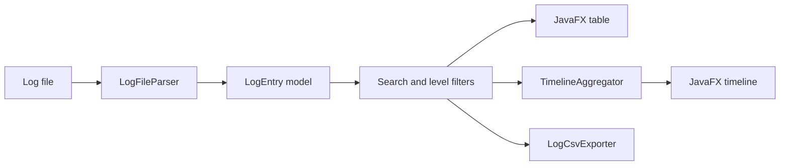

# LogScope Desktop

[](https://github.com/itqaanconsulting/logscope-desktop/actions/workflows/build.yml)

LogScope is a JavaFX desktop application for inspecting application logs locally. It parses plain-text, Spring Boot and structured JSON logs without uploading operational data to an external service.

## Features

- Open files through a file picker or drag-and-drop
- Parse files asynchronously without blocking the JavaFX interface
- Support plain-text, Spring Boot, JSON Lines and NDJSON formats
- Group multiline stacktraces with their originating log entry
- Search messages, services, threads, loggers, trace IDs and stacktraces
- Filter by `ERROR`, `WARN`, `INFO` and other levels
- Visualize error and warning peaks on a per-minute timeline
- Save filter presets and reopen recent files during the current session
- Inspect full metadata and stacktraces in a detail dialog
- Export the filtered result set as UTF-8 CSV
- Package a standalone Windows application with `jpackage`

## Demo

Run the application:

```powershell
mvn javafx:run
```

Then open or drag one of the included files into the application:

- `demo/sample-application.log`
- `demo/sample-structured.jsonl`

Suggested demo flow:

1. Import a demo file.
2. Search for `order-service` or a trace ID.
3. Disable `INFO` to focus on warnings and errors.
4. Open the timeline to inspect event peaks.
5. Double-click an error to view its stacktrace.
6. Save the current filter and export the result to CSV.

## Supported Formats

Compact text format:

```text
2026-06-09 10:42:18.413 ERROR [order-service] [req-91ac2] Payment failed
```

Spring Boot console format:

```text
2026-06-09T10:46:04.122+02:00 ERROR 14228 --- [order-service] [nio-8080-exec-5] n.i.OrderService : Request failed
```

Structured JSON Lines:

```json
{"@timestamp":"2026-06-09T11:03:13.441+02:00","log":{"level":"ERROR"},"service":{"name":"payment-service"},"message":"Payment provider unavailable","trace":{"id":"7f31c98a"}}
```

Common aliases such as `timestamp`, `severity`, `service.name`, `trace.id`, `correlation_id` and `exception.stacktrace` are recognized.

## Architecture



The parser, timeline aggregation, file validation and CSV export are separated from JavaFX controls. This keeps the core processing testable without starting a desktop UI.

## Technology

- Java 21
- JavaFX 21
- Jackson
- JUnit 5
- Maven
- GitHub Actions
- `jpackage`

## Test

```powershell
mvn clean test
```

The GitHub Actions workflow runs `mvn verify` on both Ubuntu and Windows with Java 21.

## Package For Windows

Create a standalone application containing its own Java runtime:

```powershell
.\scripts\package-windows.ps1
```

Packaging requires a full JDK 21 or newer with `jpackage`. The generated application itself does not require Java.

Start the packaged application:

```powershell
.\target\dist\LogScope\LogScope.exe
```

Build an MSI on a machine with WiX installed:

```powershell
.\scripts\package-windows.ps1 -Type msi
```

## Project Structure

```text
src/main/java/.../dashboard   JavaFX application views
src/main/java/.../log         Parsing, filtering support, timeline and export
src/test/java/.../log         Unit tests for core processing
demo                          Example plain-text and JSON log files
scripts                       Windows packaging automation
.github/workflows             Continuous integration
```

## Current Scope

Saved filters and recent files are retained for the current application session. LogScope processes local files and does not connect to remote log platforms or persist imported log content.
